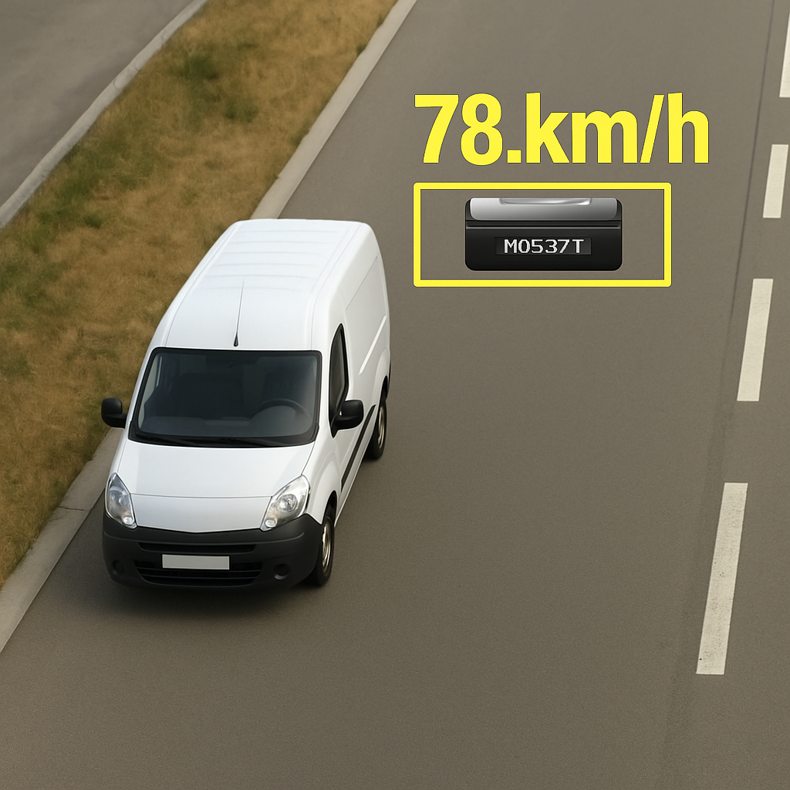

# AI traffic Watcher

Final project for the Building AI course

## Summary

AI Traffic Watcher is an intelligent surveillance system that monitors roads using camera footage to detect vehicles, recognize their license plates, and estimate their speed in real time. It supports traffic regulation and improves road safety with minimal human effort.

## Background

This project tackles key issues in traffic law enforcement and smart transportation infrastructure. Many cities and regions still rely on outdated, manual or expensive systems for speed and license plate monitoring.

Problems this idea solves:
* Inefficient manual speed monitoring
* Limited scalability in vehicle identification
* Difficulty enforcing traffic regulations automatically

Personal motivation: I'm interested in applying computer vision to solve real-world urban challenges, especially those involving safety and automation.

## How is it used?

The system can be installed with roadside or overhead traffic cameras. It runs continuously, performing the following steps:
1. Detect vehicles in the video feed using object detection
2. Extract license plate information via OCR
3. Estimate vehicle speed using motion tracking over time
4. Flag vehicles violating speed limits or store data for reports

This is useful for:
* Local traffic authorities
* Smart cities and autonomous infrastructure
* Safety analysis in accident-prone zones

### Example Output

## Data sources and AI methods

Data:
* Synthetic training data or public datasets like OpenALPR and UFPR-ALPR
* Custom video footage for testing and validation

AI methods:
* YOLOv5 or similar CNNs for vehicle detection
* EasyOCR or Tesseract for license plate recognition
* Speed estimation via optical flow and frame timestamps

| Component        | Method |
|------------------|--------|
| Vehicle detection | YOLO/CNN |
| License reading   | OCR (EasyOCR, Tesseract) |
| Speed estimation  | Frame-based velocity calculation |

## Challenges

* Weather, shadows, and lighting changes affecting detection accuracy
* Data privacy concerns related to license plate tracking
* False positives or negatives in OCR from blurry frames
* Need for calibration to estimate accurate speeds

## What next?

* Train the system with more diverse datasets (night, rain, etc.)
* Integrate a live alert system for speed violations
* Add dashboard analytics for traffic heatmaps
* Deploy on edge devices with low-power processing

## Acknowledgments

* Readme template provided by Reaktor Innovations and University of Helsinki as part of the [Building AI course](https://www.elementsofai.com/).
* Some technical references and dataset sources from:
  * [OpenALPR](https://github.com/openalpr/openalpr)
  * [UFPR-ALPR dataset](https://web.inf.ufpr.br/vri/databases/ufpr-alpr/)
* Image generated for demonstration purposes using AI image synthesis
